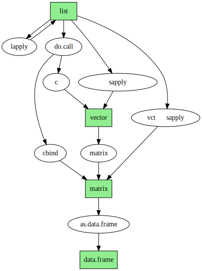

# R基本数据转换

#R #flowchat


R语言编程有时候需要将基本数据相互转换,一时想不起来可以参考该流程图进行转换:




转换代码:

```
dtf = do.call("cbind",lst)

vct = do.call("c", lst)

vct = sapply(lst, function(xx){
	xx
})

lst_new = lapply(lst, function(xx){
	xx
})
```

