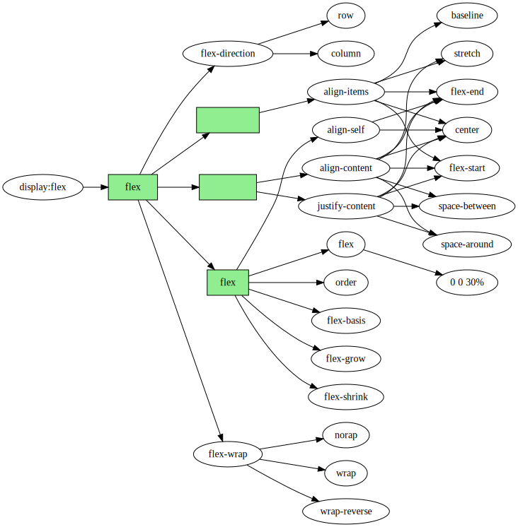

#### flex布局

#css #布局

- [参考资料](https://zhuanlan.zhihu.com/p/46684565)

flex弹性布局(flexible Box), 适合用来定义盒状模型.  模型只有两个基本概念: 容器(container)和单元(item). 

只有两个方向: 行方向(row)和列方向(column). 当一个html元素的style定义为"display:flex"的时候,这个元素就是容器, 它通过定义其它flex属性来管理下面直接子元素的排列方式. 

flex容器通过定义`flex-direction`来确定主轴, 通过定义`flex-wrap`来定义单元是否溢出换行. 在容器主轴方向的排列可以定义`justify-content`属性和`align-content`属性, 交叉轴方向的排列方式可以定义`align-items`属性.

flex有很多属性可以单独定义自己的布局方式:

- align-self
- flex
- order
- flex-basis
- flex-grow
- flex-shrink

可以用一个图来表示flex布局的定义:

