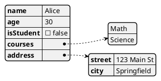
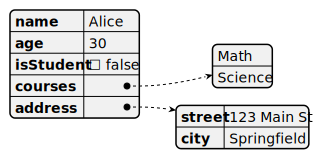

#### JSON数据格式
- [json官网](https://www.json.org/json-en.html)

JSON(Javascript 对象标记)是一个轻量级的数据交换格式. 我们可以使用plantUML来可视化一个json对象.

例如: sample_json.puml

可以生成以下图形: 

可以使用网络上的[plantUML编辑器](https://app.timelessq.com/office/plantuml-editor)或者在[plantUML官网](https://www.plantuml.com/)上编辑, 也可以安装到本地, 也可以使用vscode插件来编辑.

