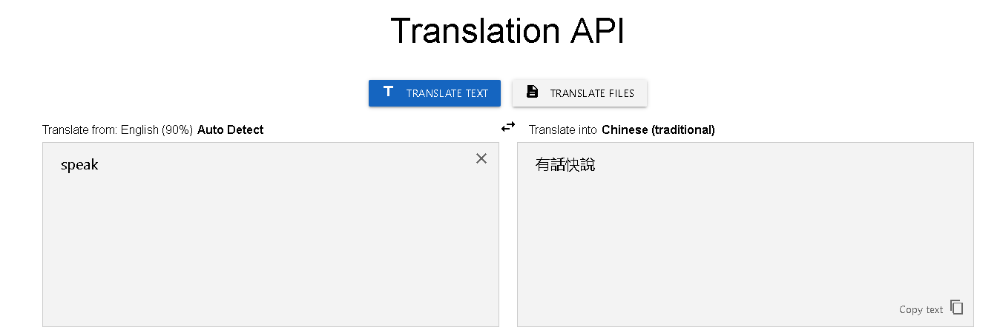

# LibreTranslate安装

#software #install #翻译


LibreTranslate是一款基于argostranslate的翻译api. 而argostranslate是一款离线翻译软件,可以用于Python库, 命令行, GUI应用. 

如果要构建一个翻译应用, 可以使用免费的api, 也可以搭建一个本地api,然后通过程序调用来访问.

为了方便, 我们也可以直接使用官方提供的[api服务](https://portal.libretranslate.com/), 专业版`$29/月`,企业版`$58/月`.

在windows中, 我们可以使用docker方式安装, 也可以直接安装. 


## windows中安装LibreTranslate方法

在windows中, LibreTranslate安装方法:

方法1, 直接安装:

1. 安装python  
   目前python版本不能太大, 我之前用3.13安装就报错.

2. 使用pip安装LibreTranslate  

   ```sh
   pip install libretranslate
   ```

3. 启动libretranslate

```sh
libretranslate.exe --load-only en,zh,zt --host 0.0.0.0
```

host参数是将端口暴露给所有访问的机器. 之后就可以使用官方的界面访问`http://localhost:5000`, `--load-only`参数是语言, 包括英文(en),中文(zh), 繁体中文(zt). 


方法2: 源码安装:  

1. 安装python
2. 下载解压[LibreTranslate-1.7.3.zip](https://github.com/LibreTranslate/LibreTranslate/archive/refs/tags/v1.7.3.zip)
3. 安装依赖软件

```
pip install --upgrade setuptools wheel
pip install virtualenv
```

4. 在当前目录创建并激活虚拟python环境

```
cd LibreTranslate-1.7.3
virtualenv myenv
myenv\Scripts\activate.bat 
```

5. 安装python依赖库torch
   这个文件比较大,首先单独安装

```
pip install D:\Download_\torch-2.4.0-cp38-cp38-win_amd64.whl
```

6. 安装

```
pip install -e .
```

安装完成之后,就会在python安装目录找到`libretranslate.exe`程序

7. 能够打开libretranslate, 就代表已经按照成功了

```sh
libretranslate.exe --load-only en,zh,zt --host 0.0.0.0
```


## 使用方法

可以有多种方式使用libretranslate, 我们通过**python方式**使用libretranslate里面的argostranslate库. 也可以使用**命令行方式**, 也可以通过**API方式**. 


### python方式

写一个python测试文件`tt.py`

```
import argostranslate.package
import argostranslate.translate

from_code = "en"
to_code = "zh"

translatedText = argostranslate.translate.translate("Hello World", from_code, to_code)
print(translatedText)
```

然后运行`python tt.py`就出翻译结果

### 命令行方式

命令行方式调用`argos-translate`, 会直接输出翻译结果.

windows中不能使用命令行直接调用, 需要首先安装git, 然后通过git里面的bash功能来调用:

```
# 安装语言包
D:\Install\Git\bin\bash.exe -c "D:/Install/python/Scripts/argospm install <path_to_model_file>"

# 翻译
D:\Install\Git\bin\bash.exe -c "D:/Install/python/Scripts/argos-translate --from en --to zh \"Hello World!\""

# 列出语言包
D:\Install\Git\bin\bash.exe -c "D:/Install/python/Scripts/argospm list"
```


### API方式

通过网页界面访问也比较方便, 适合不需要定制的人使用.

先输入命令, 然后访问`http://localhost:5000`:

```
libretranslate.exe --load-only en,zh,zt --host 0.0.0.0
```

看到的界面如下.



也可以通过API方式发送http请求:

```sh
curl -X POST http://localhost:5000/translate -d q="Hello" -d source=en -d target=zh
```


## 语言模型


最开始运行libretranslate的时候, 要下载语言模型包, 等下载完成之后,就可以访问了.

也可以直接去官网上[下载语言包](https://www.argosopentech.com/argospm/index/),模型名字如下:

```
translate-en_zh-1_9.argosmodel
translate-en_zt-1_9.argosmodel
translate-zh_en-1_9.argosmodel
```

下载完成后放到:`C:\Users\xxx\.local\share\argos-translate\packages`目录下通过之前介绍的命令安装.


## python输出问题

由于python的一个包在torch.load使用了不安全的方式调用, python方式翻译输出结果会出现一大堆警告信息, 大致如下:

```
 You are using `torch.load` with `weights_only=False`
```

所以修改一下源码, 添加一个`weights_only`参数:

```
# stanza\models\tokenize\trainer.py:85

try:
        checkpoint = torch.load(filename, lambda storage, loc: storage,weights_only=True)
        except BaseException:

```


